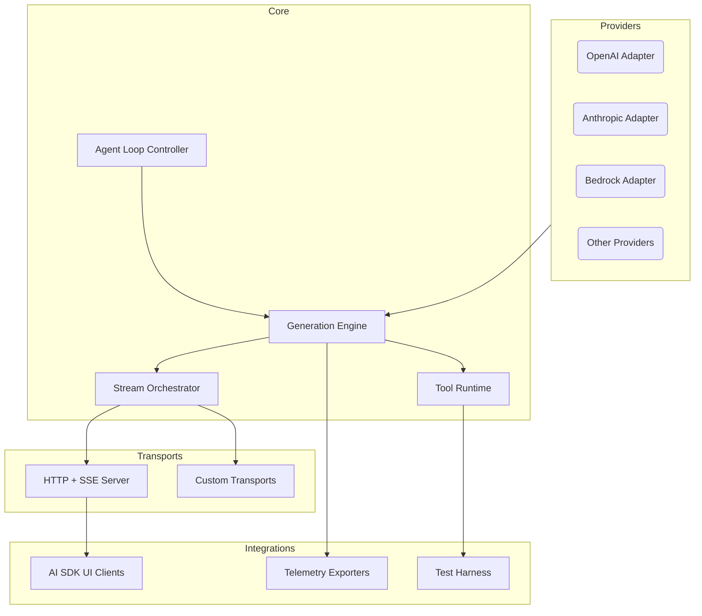

# AI SDK for Rust — Specification v1.1

> **Document status**: Draft for internal review. Targets feature parity with the TypeScript AI SDK v6 release family, adding first-class chat, RAG, and agent loop coverage for the Rust implementation.

## 1. Overview
- Deliver a Rust-native SDK that mirrors the ergonomics of `@ai-sdk/*` packages while embracing Rust idioms (ownership, traits, async/await, `Result`).
- Support text generation, structured outputs, tool calling, multi-step agent loops, streaming transforms, and chat transports compatible with AI SDK UI clients (`useChat`, `DefaultChatTransport`).[^core-text][^core-structured][^core-tools][^ui-chat]
- Provide retrieval-augmented generation (RAG) primitives (chunking, embeddings, vector search) that map onto the cookbook guidance and allow turnkey integration with Rust data stores.[^rag-guide][^core-embeddings]
- Provide adapters for enterprise providers (`OpenAI`, `Anthropic`, `Azure OpenAI`, `Amazon Bedrock`, `Groq`, `Google Generative AI`, `Mistral`, `Ollama`, `OpenRouter`) with feature coverage comparable to existing TypeScript bindings.
- Ship reference transports (HTTP + Server-Sent Events) interoperable with AI SDK UI consumers and gateway routing.[^ui-transport][^ui-stream]

### 1.1 Goals
- Trait-driven architecture enabling pluggable providers, transports, middleware, observability, and RAG stores.
- Type-safe streaming (text, structured objects, tool deltas) using Rust async streams and UI message parts.
- Explicit control over multi-step agent loops (`stop_when`, `prepare_step`) and tool lifecycle hooks, with parity to AI SDK agent APIs.[^agents-loop]
- Seamless chat UX integration via SSE wire compatibility, status/event propagation, and typed client payloads.
- First-class telemetry (OpenTelemetry), testing utilities, and comprehensive documentation with migration guidance.

### 1.2 Non-Goals
- Re-implementing framework-specific UI components (e.g., React hooks) in Rust.
- Providing a fully managed hosting platform; focus is SDK-level building blocks.
- Backward compatibility with pre-v5 SDK semantics; migration paths described separately.

## 2. System Architecture
A layered design separates core orchestration from adapters and transports.



### 2.1 Module Breakdown
- `ai_core`: public APIs (`generate_text`, `stream_text`, `generate_object`, `stream_object`, `call_tools`).
- `ai_stream`: stream primitives, smoothing transforms, SSE encoding.
- `ai_tooling`: tool definitions, registry, lifecycle hooks, repair strategies.
- `ai_providers::*`: each provider implements a `ModelProvider` trait with capability flags and per-model option types.
- `ai_transport`: `ChatTransport` trait, HTTP/SSE default implementation, plus extensibility for WebSockets or gRPC.
- `ai_telemetry`: telemetry exporters, middleware instrumentation, token usage accounting.
- `ai_testing`: test doubles, mock providers, golden-stream fixtures.

## 3. Core Abstractions
### 3.1 Provider & Model Traits
- `ModelProvider`: resolves model identifiers, normalizes provider-specific settings, and issues HTTP requests. Must expose capability metadata (tool support, structured outputs, reasoning).
- `Model`: encapsulates base URL, auth, default parameters, and optional feature gates.
- Providers register via lightweight plugin registry supporting dynamic loading (feature-flagged).

### 3.2 Request & Response Types
- `GenerateTextRequest` / `GenerateTextResponse` mirror JavaScript API shapes while using `Cow<'a, str>` and strongly typed enums (finish reasons, warning kinds).
- Responses expose both immediate data (`text`, `usage`) and lazily resolved handles for `reasoning`, `sources`, `tool_calls`, matching TypeScript promise semantics via async getters.[^core-text]
- Error taxonomy mirrors AI SDK error classes (e.g., `NoSuchToolError`, `InvalidToolInputError`) mapped into Rust `enum` variants with `thiserror` for display.

### 3.3 Async Streaming
- `StreamTextHandle`: exposes `text_stream` (async stream of token deltas), `full_stream` (typed enum for all events), `to_ui_message_stream()` adapter.
- Transform pipeline accepts boxed middleware implementing `StreamTransform` trait, enabling smoothing or guardrail enforcement prior to client callbacks.[^core-text]

## 4. Chat & Streaming Integration
- Chat transports must preserve AI SDK UI semantics for status (`submitted`, `streaming`, `ready`, `error`) and message parts (text, tool invocations, files, sources) to avoid downstream UI drift.[^ui-chat]
- Engines emit structured metadata (usage, reasoning, sources) so clients can surface token dashboards or citations without additional provider calls.

### 4.1 Chat Transport Compatibility
- Provide `ChatTransport` reference implementation that reads `UIMessage` payloads, forwards optional headers/body overrides, and exposes `stop()` + `regenerate()` handlers consistent with the JavaScript hooks.[^ui-chat]
- Support optimistic UI updates (local echo) by returning the user message immediately and streaming assistant parts once available.
- Allow per-request overrides (headers, body, metadata) to be merged with transport defaults, matching `DefaultChatTransport` precedence rules.[^ui-transport]

```rust
pub async fn post_chat(
    State(app): State<AppState>,
    Json(payload): Json<ChatRequest>,
) -> Result<Sse<impl Stream<Item = Result<Event, Infallible>>>, ChatError> {
    let ChatRequest { messages, metadata, headers } = payload;

    let stream = app.engine.stream_text(StreamTextConfig {
        model: app.providers.openai("gpt-4.1-mini"),
        system: Some(app.prompts.chat.clone()),
        messages,
        stop_when: Some(step_count_is(6)),
        transport_overrides: headers.into(),
        on_status: Some(|status| app.telemetry.record_chat_status(status)),
    });

    let ui_stream = stream
        .to_ui_message_stream()
        .with_status_events()
        .with_abort_handle(app.abort_registry.track(metadata.session_id));

    Ok(Sse::new(ui_stream.into_sse())
        .keep_alive(KeepAlive::new().interval(Duration::from_secs(15)).text(":\n")))
}
```

### 4.2 Server-Sent Events
- SSE encoder matches AI SDK UI format: events labelled `message`, `data`, `metadata`, with JSON payloads compatible with `UIMessageStream`.[^ui-stream]
- Provide reference SSE handler for Axum, `Actix`, and Warp showcasing `create_ui_message_stream()` analog and keep-alive intervals tuned for browsers.
- Support transient data parts, reconciliation by ID, and source streaming via typed helper APIs.

## 5. Structured Outputs
- `generate_object` validates output against `serde`-compatible schemas (native or via `schemars`). Provide adapters for `zod` parity using JSON Schema translation.[^core-structured]
- `stream_object` yields `partial_object_stream` and `element_stream`, enforcing incremental validation and merge semantics.
- Experimental `experimental_output` parity delivered via optional feature flag; annotate breaking-change risk.

## 6. Retrieval-Augmented Generation
- Ship a `RagStore` trait that abstracts ingestion (chunking), embedding, similarity search, and metadata hydration so users can plug in Postgres + `pgvector`, SQLite extensions, or cloud vector stores.[^rag-guide][^core-embeddings]
- Provide ingestion helpers (`ChunkStrategy`, `EmbedManyJob`) with back-pressure handling and retry-aware background tasks.
- Runtime integrates retrieval hits into the chat/agent pipeline by appending citations, source documents, and structured metadata to the outgoing stream.

```rust
pub async fn rag_answer(
    State(app): State<AppState>,
    Json(request): Json<RagQuery>,
) -> Result<Response, RagError> {
    let chunks = app.rag_store.similarity_search(SimilaritySearch {
        query: app.embeddings.embed(&request.prompt).await?,
        top_k: 4,
        min_score: 0.5,
    }).await?;

    let result = app.engine.stream_text(StreamTextConfig {
        model: app.providers.openai("gpt-4.1"),
        system: Some(app.prompts.rag.clone()),
        messages: request.messages,
        stop_when: Some(step_count_is(5)),
        tools: app.tools.clone(),
        attachments: RagAttachments::from(chunks.clone()),
    });

    Ok(result
        .to_ui_message_stream()
        .with_source_parts(chunks.into_iter().map(SourcePart::from))
        .into_http_response()?)
}
```

- Expose async traits for declarative retrievers (pre/post filters, hybrid search) and cache policy hooks to preserve low-latency responses under bursty workloads.[^rag-guide]

## 7. Tool Calling & Agent Loops
- Tool definitions leverage procedural macros to derive schemas and metadata while preserving manual control.
- `ToolExecutionContext` exposes `tool_call_id`, prior messages, abort signals (`CancellationToken`), and optional experimental context.[^core-tools]
- Loop controller implements `stop_when` predicates and `prepare_step` hooks with ergonomic builders, matching AI SDK loop semantics (arrays, custom closures, manual loops).[^agents-loop]
- Steps recorded with full content history for conversation replay, with APIs to inspect usage and reasoning traces.

## 8. Transport Integration
- Default HTTP transport accepts dynamic header/body resolvers, mirroring JavaScript `DefaultChatTransport` behaviors and enabling authenticated per-request overrides.[^ui-transport]
- Transport trait abstracts over `send_messages` and `stream_messages`, enabling WebSocket or SSE-first clients.
- Ensure compatibility tests using captured AI SDK UI fixtures and include gateway-aware routing for multi-provider fallbacks.[^gateway]

## 9. Provider Adapters
- Each adapter resides in `ai_providers/{name}` with consistent layout: model catalog, capability map, request signer, response normalizer.
- Capability matrix maintained in `appendices/provider-matrix.md` (generated docs).
- Authentication handles environment variables, per-request overrides, and metadata propagation (request IDs, billing buckets).
- Implement provider-specific features: OpenAI reasoning fields, Anthropic computer tool results, Bedrock guardrail headers, `Vercel` AI Gateway routing hints.[^gateway]

## 10. Observability & Telemetry
- Integrate OpenTelemetry spans for request lifecycle, tool execution, stream emission.
- Emit structured logs for stream events and errors, with log levels aligning to severity.
- Usage accounting surfaces prompt/completion tokens, cost estimation hooks, and gateway user/tag metadata.

## 11. Testing Strategy
- Provide mock providers returning deterministic streams.
- Golden-stream fixtures ensure SSE compatibility; snapshot tests validate event ordering and chat status transitions.
- Property-based tests confirm schema validation, tool repair correctness, and retriever score ordering.
- Ship runnable examples in `examples/rust/chat`, `examples/rust/rag-agent`, and `examples/rust/tool-loop` with integration tests that assert end-to-end parity against captured TypeScript responses.

## 12. Security Considerations
- Mandatory request signing for external providers; enforce TLS via SDK configuration defaults.
- Sandboxed tool execution (async boundaries, resource limits) with optional WASM runner for untrusted tools.
- Input validation before provider calls; redact secrets in logs and telemetry.

## 13. Versioning & Release Plan
- Semantic versioning (`0.x` pre-release, `1.0` once parity achieved).
- Change-log automation, breaking change policy mirroring JS SDK (pre-release tags for experimental APIs).
- Feature flags for experimental structured outputs and tool repair.

## 14. Migration Guidance
- Provide mapping table between TypeScript API calls and Rust equivalents (see `appendices/api-comparison.md`).
- Cookbook examples translating common patterns (chatbot, RAG, agent loops) from Node to Rust, including gateway configuration references.
- Document adoption guidance for existing Rust services (sync vs async contexts, telemetry integration, retriever backfill).

## 15. Appendices
- A. `appendices/wire-format.md`: SSE event schema, message metadata rules.
- B. `appendices/provider-matrix.md`: capability comparison across providers.
- C. `appendices/api-comparison.md`: TypeScript vs Rust API reference.
- D. `appendices/references.md`: canonical documentation citations (update with chat, RAG, agent sources).
- E. `appendices/example-manifest.md`: inventory of runnable Rust examples, fixtures, and associated tests.

---

[^core-text]: AI SDK Core — Generating and Streaming Text. https://ai-sdk.dev/docs/ai-sdk-core/generating-text
[^core-structured]: AI SDK Core — Generating Structured Data. https://ai-sdk.dev/docs/ai-sdk-core/generating-structured-data
[^core-tools]: AI SDK Core — Tool Calling. https://ai-sdk.dev/docs/ai-sdk-core/tools-and-tool-calling
[^ui-chat]: AI SDK UI — Chatbot. https://ai-sdk.dev/docs/ai-sdk-ui/chatbot
[^rag-guide]: AI SDK Cookbook — RAG Agent Guide. https://ai-sdk.dev/cookbook/guides/rag-chatbot
[^core-embeddings]: AI SDK Core — Embeddings. https://ai-sdk.dev/docs/ai-sdk-core/embeddings
[^ui-transport]: AI SDK UI — Transport. https://ai-sdk.dev/docs/ai-sdk-ui/transport
[^ui-stream]: AI SDK UI — Streaming Custom Data. https://ai-sdk.dev/docs/ai-sdk-ui/streaming-data
[^agents-loop]: AI SDK Agents — Loop Control. https://ai-sdk.dev/docs/agents/loop-control
[^gateway]: AI SDK Providers — AI Gateway. https://ai-sdk.dev/providers/ai-sdk-providers/ai-gateway
